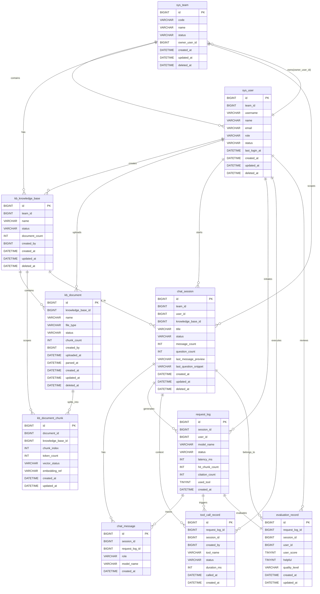

# E-R 图

基于项目根目录下的 [schema.sql](E:\workspace\vscode\assistant-front\schema.sql) 整理。

## 整体 E-R 图

## 说明

- `sys_team` 和 `sys_user` 构成平台的组织与用户基础层。
- `kb_knowledge_base`、`kb_document`、`kb_document_chunk` 构成知识库与检索内容层。
- `chat_session`、`chat_message` 构成问答会话事实层。
- `request_log` 是一次问答请求的观测快照。
- `tool_call_record` 记录请求过程中触发的工具调用。
- `evaluation_record` 记录请求级最终评测结果，当前阶段按“一次请求一条最终评测记录”设计。
